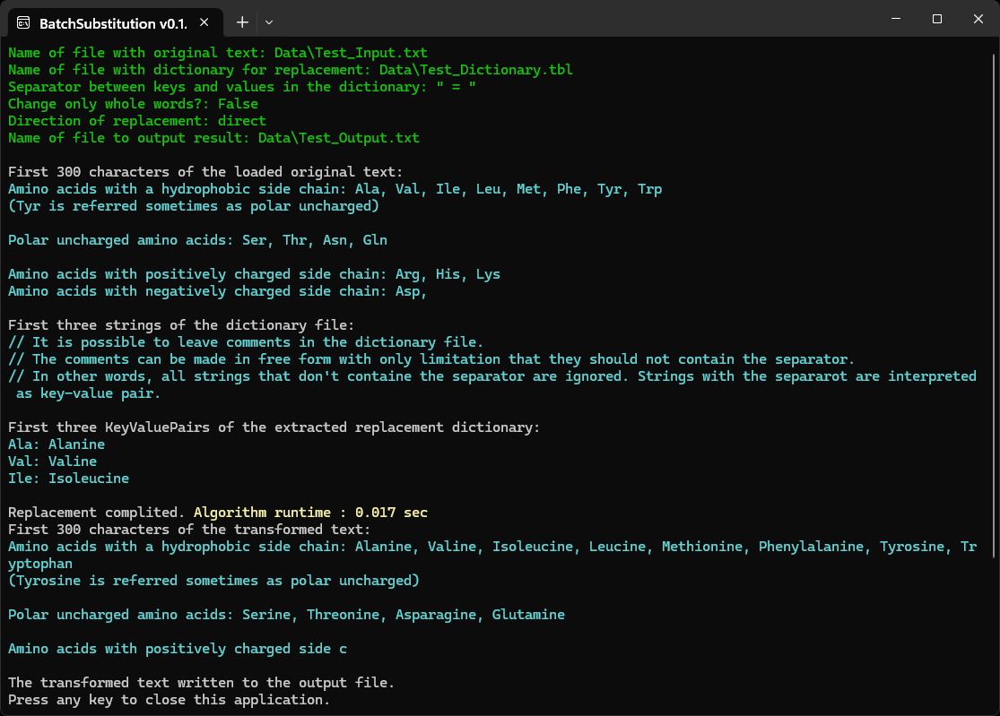

**BatchSubstitution** is a simple console program that allows to make at once multiple replacements in the text according to a dictionary saved in a separate file, in both direction. If was created for purposes of romhacking.

Options that can be transmit to the program via parameters:
- User's separator between keys and values in the dictionary.
- Whether only whole words should be replaced (to avoid false positive cases).
- Direction of replacement: whether keys are changed to values or values to keys (provided they are unique).

To launch the application with parameters, it is convenient to use a bat-file. The folder <code>[files_for_test](./files_for_test)</code> contains example of such file with additional explanations. Place contents of that folder in directory with built application and launch the bat-file so the application can demonstrate its work.

LIMITATION: The current version of the application allows to make only simple replacements, like "small dog" to "big cat". It can't work with cases involving backslash (`\`), escape characters (like `\t`) and multiline replacements. It's possible that I'll improve the application after a while.

The ready program can be downloaded from my [Google-drive](https://drive.google.com/drive/folders/1bKi2YhASs64yPvZEugPNbk2VVjtwaamN).