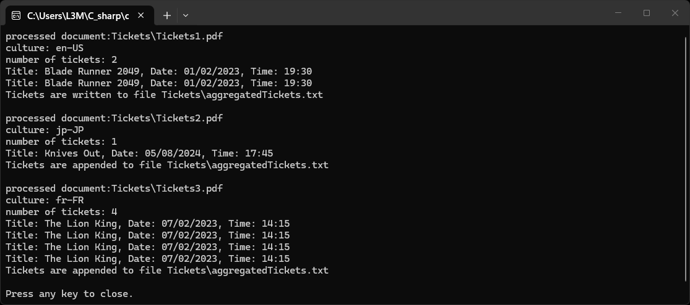

This is my curriculum program for extraction and aggregation data from PDFs for the online course "[Ultimate C# Masterclass for 2026](https://www.udemy.com/course/ultimate-csharp-masterclass/)" _(Udemy)_. The working name of the assignment is "TicketsDataAggregator". The program extract data about cinema tickets from several pdf-files in a given folder, combined data and write the result into a text file. The intermediate info is displayed in the console.

I adopted the structural model from the previous course assignments and borrowed some pieces of code from the course, but overall, the code is mine.

