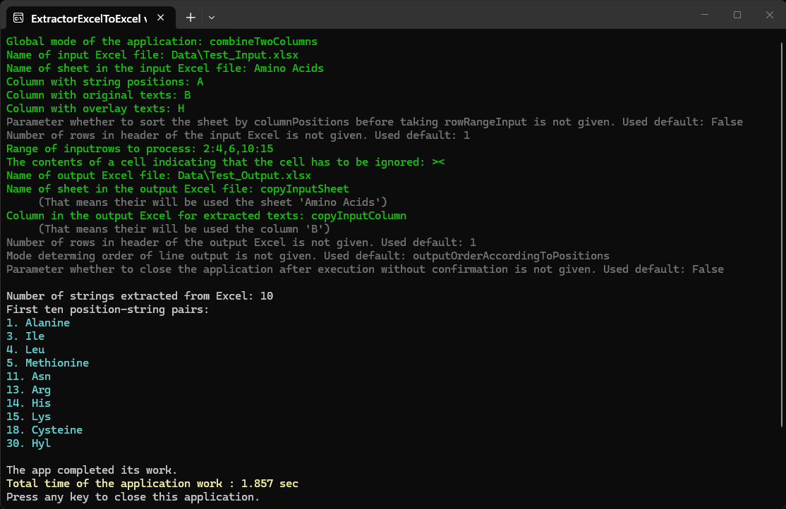
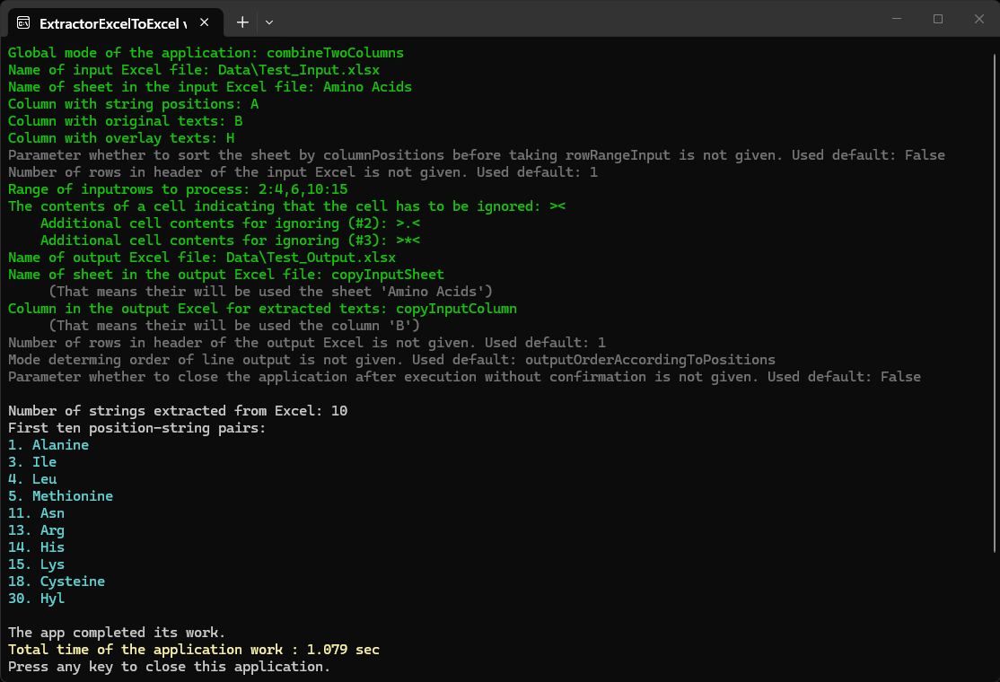

**ExtractorExcelToExtractor** is a console program for extraction texts from one Excel file to another Excel file. 
My other related programs: [ExtractorExcelToText](../ExtractorExcelToText), [ExtractorTextToExcel](../ExtractorTextToExcel).

To launch the application with parameters, it is convenient to use a bat-file. The folder <code>[files_for_test](./files_for_test)</code> contains ReadMe with explanation of parameters and examples of bat-files. Place contents of that folder in directory with built application and launch the bat-file so the application can demonstrate its work.

Some options that can be transmit to the program via parameters:
- mode: extract one column or combine two columns;
- whether positions of strings are determined in a separate columns of the input Excel file or auto-numberings is used;
- flexible selection of rows in the Excel file for processing, including ability to ignore certain cells by their position or contents;
- preliminary sorting of worksheet by column with positions of strings before taking selection of rows that can be required in some complex cases;
- сorrection of the program behavior for different header depths in input and output files;
- additional options allowing to place transferred texts to the output file more flexibly.

These options allow to implement a wide range of ways of text extractions required for complex projects.

The compiled program for win-x64 runtime can be downloaded from my [Google-drive](https://drive.google.com/drive/folders/1FpU_Y2EDSh62-5czvj8QLNYw7YfBqTiK).