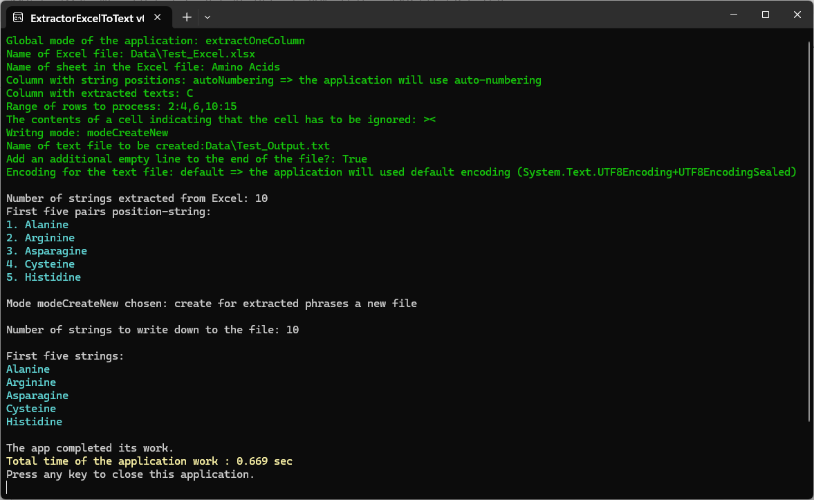
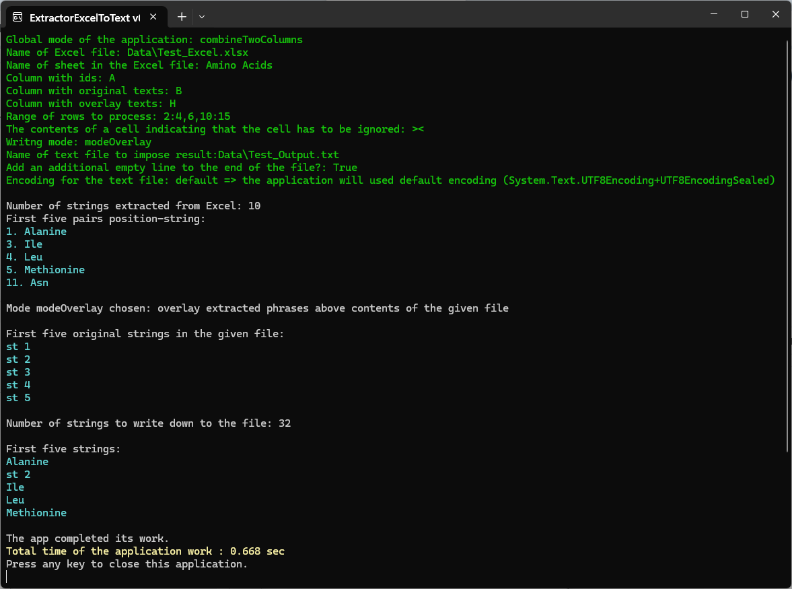

**ExtractorExcelToText** is a program for extraction texts from Excel to a text file, with optional overlay.

**The program is in the process of creation.**

To launch the application with parameters, it is convenient to use a bat-file. The folder <code>[files_for_test](./files_for_test)</code> contains ReadMe with explanation of parameters and examples of bat-files. Place contents of that folder in directory with built application and launch the bat-file so the application can demonstrate its work.

Options that can be transmit to the program via parameters:
- mode: extract one column or combine two columns;
- whether positions of strings are determined in a separate columns of the Excel file or auto-numberings is used;
- flexible selection of rows in the Excel file for processing, including ability to ignore certain cells;
- mode: create a new file for the result or to overlay the result on the contents of an existing text file in accordance with the lines positions;
- encoding of the created text file.

The ready program can be downloaded from my [Google-drive](https://drive.google.com/drive/folders/1dVUmed45JQV0hiPo3bkBh56TnDT_o4JW).