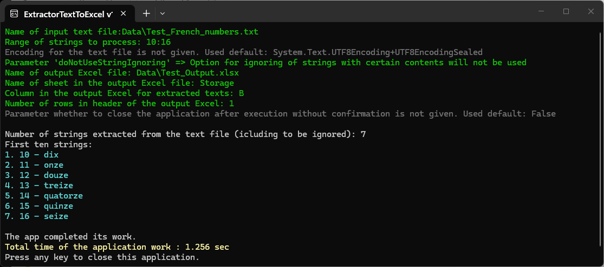
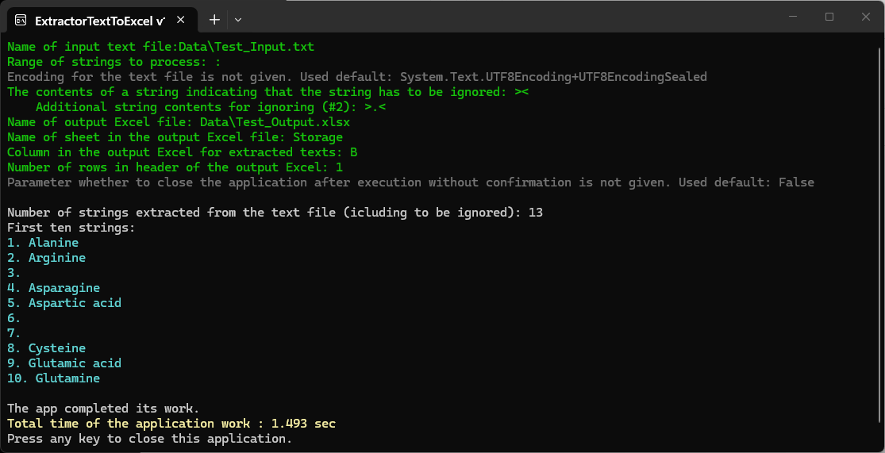

**ExtractorTextToExcel** is a console program for extraction strings from a text file to an Excel file. 
My other related programs: [ExtractorExcelToExcel](../ExtractorExcelToExcel), [ExtractorExcelToText](../ExtractorExcelToText).

To launch the application with parameters, it is convenient to use a bat-file. The folder <code>[files_for_test](./files_for_test)</code> contains ReadMe with explanation of parameters and examples of bat-files. Place contents of that folder in directory with built application and launch the bat-file so the application can demonstrate its work.

Some options that can be transmit to the program via parameters:
- selection of strings in the text file for processing, including ability to ignore strings with sertain contents;
- сorrection of string arrangement depending on depth of header in the output Excel.

The compiled program for win-x64 runtime can be downloaded from my [Google-drive](https://drive.google.com/drive/u/0/folders/1TAZA4NaYgG38VcZY6yUO3dVPG2Yhzyor).