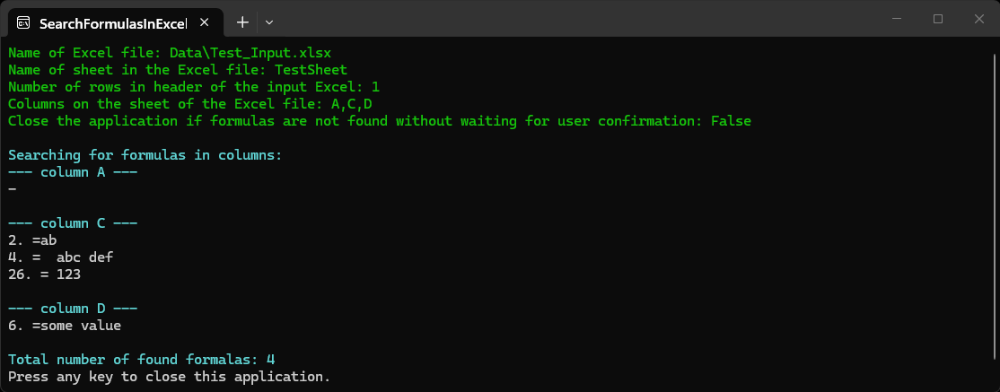

**SearchFormulasInExcel** is a console program for checking selected columns in an Excel file for formulas. It is design to protect other program for working with the Excel file (like [ExtractorExcelToExcel](../ExtractorExcelToExcel) and [ExtractorExcelToText](../ExtractorExcelToText)) in case if the presence of formulas can cause problems in them.

The compiled program for win-x64 runtime can be downloaded from my [Google-drive](https://drive.google.com/drive/folders/1f9UzRG_Wq4wc-cmFwSi1oljoQeUeSlEW).