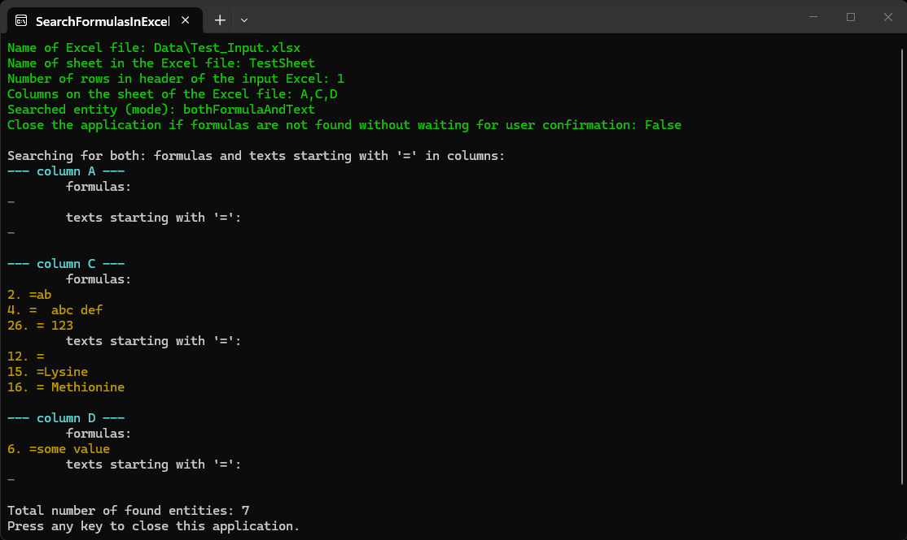

**SearchFormulasInExcel** is a console program for checking selected columns in an Excel file for formulas. It is design to protect other program for working with the Excel file (like [ExtractorExcelToExcel](../ExtractorExcelToExcel) and [ExtractorExcelToText](../ExtractorExcelToText)) in case if the presence of formulas can cause problems in them.

Explanation of the need for verification. 
If the contents of the cells contain formulas, an attempt to transfer their values by some programs may cause them to be interrupted with an error or to replace silently the contents with the value "**#VALUE!**". The choice of one of these behavior options depends on nuances and is hardly predictable. 
On the other hand, if there is text starting with "=" in the cells, the transfer of content occurs without problems. Нowever, once transferred to the new location, the text may be interpreted as a formula there, which can lead to problems later on.

The program allows to search in Excel files formulas and/or texts starting with "=" by user's choice.

Screenshots with examples of work:

The compiled program for win-x64 runtime can be downloaded from my [Google-drive](https://drive.google.com/drive/folders/1f9UzRG_Wq4wc-cmFwSi1oljoQeUeSlEW).