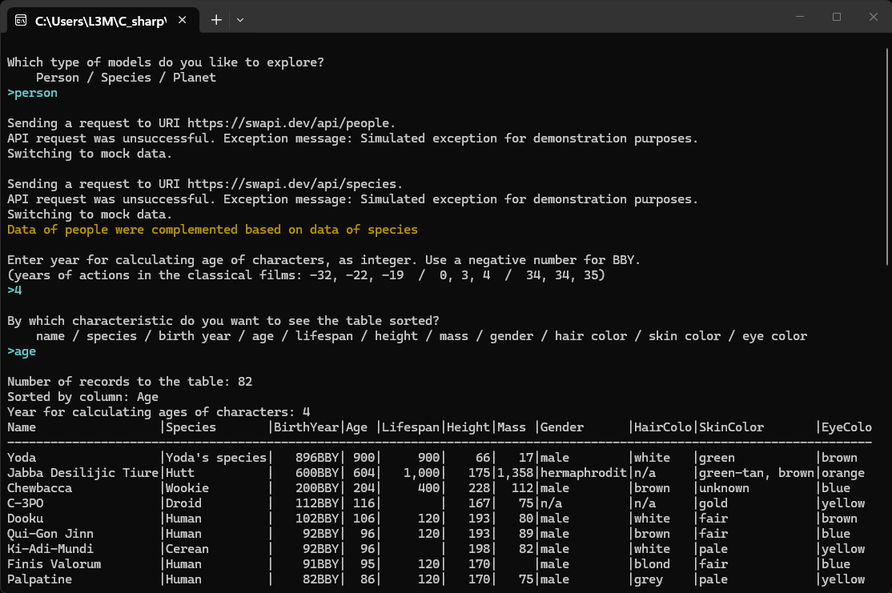
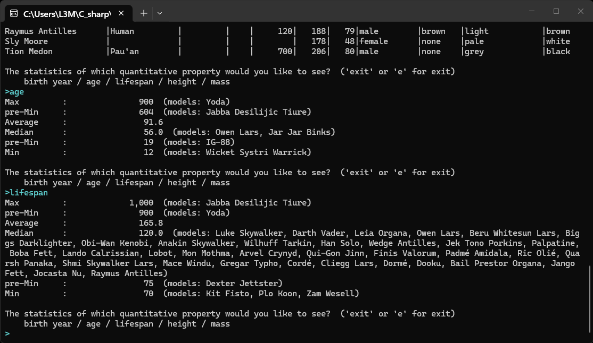
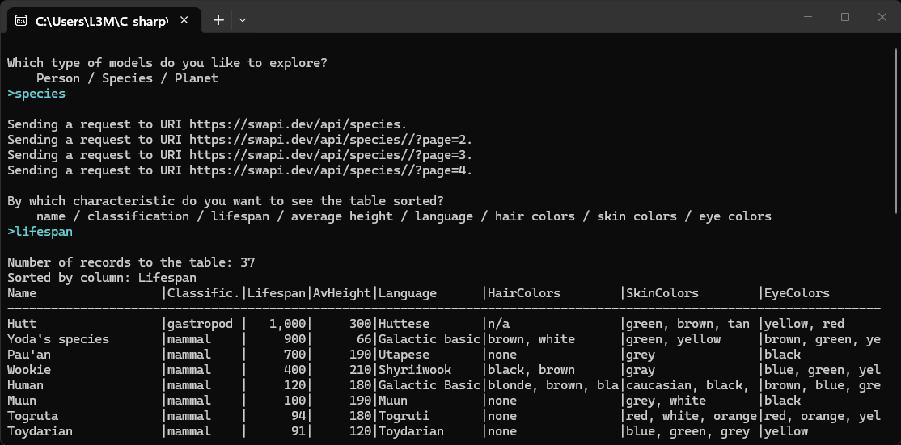
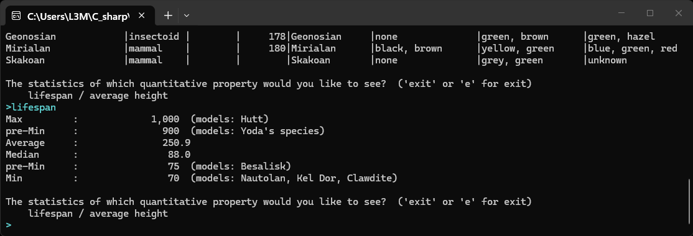

This is my curriculum program for interacting via API with a server [SWAPI](https://swapi.dev/api/) that provides data about the Star Wars franchise. The program is based on a training assignment from the online course "[Ultimate C# Masterclass for 2026](https://www.udemy.com/course/ultimate-csharp-masterclass/)" _(Udemy)_. But I've made the program much more versatile and added a lot of new features.

At the first step, the application allows to choose the type of data you want to explore. At this version, three types are supported _(characters/species/planets)_, but the application can be easily expanded to include other types. The data is downloaded from the server in several queries, combined, and are shown in a table with easily modified design. The user can choose which of the table the table will be sorted by. If the server does not respond, then an imitation of its response is used.

In the case of planets being explored, I implemented the addition of Earh to the list - I was curious to see how our planet looks against the background of the main planets of the Star Wars franchise.

In the case of characters being explored, the application downloaded two types of data: characters and species. Character models are supplemented with information on their species. In the next step, the program asks the user for a milestone year and calculates the age of the charactes in that year. Since the server does not contatin data on death dates, in some cases this age is theoretical - how old would some characters be if they had not died earlier.

After the table, the user can get additional characteristics of quantitative indicators _(such as average and median values)_. Their list can be easily expanded.

 

> [!NOTE]
> My main curiosity was to figure out how old the most powerful Star Wars characters were in the year of the key events in the franchise. It's extremely surprising that in such a high-tech world there is no technology of biological rejuvenation. It''s completely logical that the lifespan of all high-ranking and wealthy characters in such a world should be biologically unlimited _(until they die in an accident, are killed, commit suicide, etc.)_. They should also look and be in the health of their prime.

 

$$\color{orange}{\text{Warnings and disclaimers}}$$:
* The program is not ideal. For example, in some cases I haven't find a good solution for universal code that can handle multiple types of data, so I've created separate branches for different types. Perhaps I'll improve the program in the future.
* The data is provided by the learning server and not all information exactly corresponds to what is generally accepted in the "Legends" and "Canon". _(For example, for Palpatine's year of birth the server gives out 82BBY but online sources say 84BBY.) Some numbers in the "Legends" and "Canon" are different (for example, Qui-Gon Jinn was born in 92BBY according to the "Legends", and in 80BBY according to the "Canon").
* There are several cases, there the server outputs frantional values (for example, Anakin Skywalker was born at 41.9BBY). Since I wanted to focus on the global structure of the application, in such cases I used rounding.

 

Screenshots:

