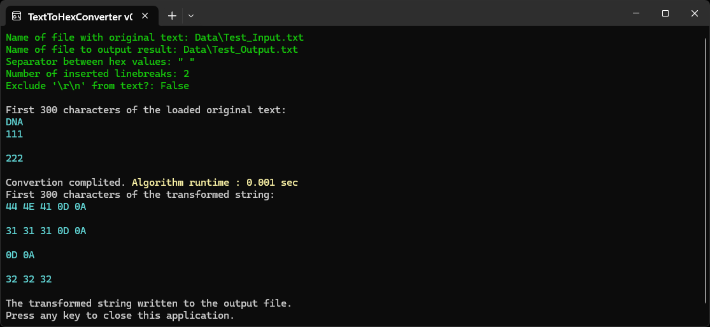

**TextToHexConverter** is a simple console program that allows to convert text to hex values. If was created for purposes of romhacking.

Options that can be transmit to the program via parameters:
- choose separator between hex-values;
- whether to include additional line breaks in places of line breaks in the original text or to exclude them;
- whether to exclude symbols `\r\n` (transformed to `0D 0A`) from the output.

To launch the application with parameters, it is convenient to use a bat-file. The folder <code>[files_for_test](./files_for_test)</code> contains example of such file with additional explanations. Place contents of that folder in directory with built application and launch the bat-file so the application can demonstrate its work.

The ready program can be downloaded from my [Google-drive](https://drive.google.com/drive/folders/1uxXP-JyNtAs0KA-8p6xM28QLFlQFwzHU).